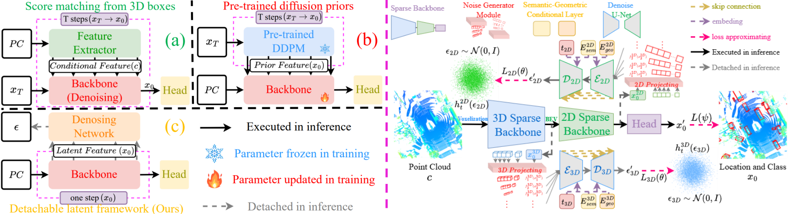

# RSDNet

This repo is the official project repository of the paper **_Robust Single-Stage Fully Sparse 3D Object Detection via Detachable Latent Diffusion_**. 
 -  [ [arXiv](https://arxiv.org/pdf/2508.03252) ]
 -  The code will be released shortly...
 -  The code is being organied...[08/12/2025]
## The Overall Framework 
 <br/>
## Citation
If you find our paper useful to your research (3D Detection or modeling multiple perturbations), please cite our work as an acknowledgment.
```bib
@article{qu2025robust,
  title={Robust Single-Stage Fully Sparse 3D Object Detection via Detachable Latent Diffusion},
  author={Qu, Wentao and Mei, Guofeng and Wang, Jing and Wu, Yujiao and Huang, Xiaoshui and Xiao, Liang},
  journal={arXiv preprint arXiv:2508.03252},
  year={2025}
}
```

## Motivation of Modeling Multiple Perturbations in DDPMs
- Enabling arbitrary distribution modeling would be a significant extension of DDPMs.
- Since the prior distribution is defined as Gaussian, exiting DDPMs only can model Gaussion distributions.
- However, for some tasks, Gaussian distributions maybe not the optimal choice, such as image restoration or super-resolution (often follow Laplacian distributions), fluorescence microscopy (often follow Passion distributions).
- Modeling other distributions in DDPMs requires rederiving the posterior (the ground truth in DDPMs). 
- This is highly impractical due to the complex derivations involved.
- The training of DDPMs essentially performs **_distribution matching_**.
- **_Distribution matching_** aims to sample accurate intermediate variables, xt, xt-1,...,x0.
- So, can we directly fit these intermediate variables and introduce perturbations to achieve diverse generation?
- Thus, we introduce the notion of **_sample fitting_** to realize the noise-injection and denoising mechanisms in DDPMs.
- This allows us to discard explicit distribution assumptions, since we directly fit the intermediate variables.
- This removes the need to rederive the posterior, as intermediate variables are no longer sampled from a distribution but directly predicted.
- Moreover, generation remains driven by stochastic perturbations introduced at inference, preserving diversity.
- Our method is intended to broadly impact generative tasks, as it offers a general concept.
- **_We plan to release extended versions in future work._**
- For the detailed idea, please refer to the uploaded [PDF](https://github.com/QWTforGithub/RSDNet/blob/main/the%20fifth%20report.pdf) (the author’s group-meeting presentation slides).

## Overview
- [Installation](#installation)
- [Data Preparation](#data-preparation)
- [Model Zoo](#model-zoo)
- [Quick Start](#quick-start)

## Installation

### Requirements
The following environment is recommended for running **_RSDNet_** (four or eight NVIDIA 4090 GPUs):
- Ubuntu: 18.04 and above
- gcc/g++: 7.5 and above
- CUDA: 11.6 and above
- PyTorch: 1.13.1 and above
- python: 3.8 and above

### Environment

- Base environment
```
conda create -n dlf python=3.8 -y
conda activate dlf
pip install torch==1.13.1+cu116 torchvision==0.14.1+cu116 torchaudio==0.13.1 --extra-index-url https://download.pytorch.org/whl/cu116

cd RSDNet-main/envs
pip install -r requirements1.txt
pip install -r requirements2.txt
pip install -r requirements3.txt
pip install -r requirements4.txt
pip install -r requirements5.txt
pip install -r requirements6.txt
pip install -r requirements7.txt
pip install -r requirements8.txt
pip install -r requirements9.txt

cd RSDNet-main
python setup.py develop
```

## Data Preparation
- Please prefer to [OpenPCDet](https://github.com/open-mmlab/OpenPCDet/blob/master/docs/GETTING_STARTED.md) for building datasets (nuScenes and Waymo Open).

### nuScenes
- Download the official [nuScenes](https://www.nuscenes.org/nuscenes#download) (or [Baidu Disk](https://pan.baidu.com/s/1Rsbi-Q_2EUm05lwQgn8T3Q?pwd=1111)(code:1111)) dataset (with Lidar Segmentation) and organize the downloaded files as follows:
  ```bash
  RSDNet-main/data
    ├── nuscenes
    │   │── v1.0-trainval (or v1.0-mini if you use mini)
    │   │   │── gt_database_10sweeps_withvelo
    │   │   │── lidarseg
    │   │   │── maps
    │   │   │── samples
    │   │   │── sweeps
    │   │   │── v1.0-mini
    │   │   │── v1.0-test
    │   │   │── v1.0-trainval
    │   │   │── nuscenes_10sweeps_withvelo_lidar.npy
    │   │   │── nuscenes_dbinfos_10sweeps_withvelo.pkl
    │   │   │── nuscenes_infos_10sweeps_train.pkl
    │   │   │── nuscenes_infos_10sweeps_val.pkl
  ```
  
### Waymo Open
- Download the official [Waymo Open](https://waymo.com/open/download/) dataset (with Lidar Segmentation) and organize the downloaded files as follows:
  ```bash
  RSDNet-main/data
    ├── waymo
    │   │   │── ImageSets
    │   │   │── raw_data
    │   │   │── waymo_processed_data_v0_5_0
    │   │   │── waymo_processed_data_v0_5_0_gt_database_train_sampled_1
    │   │   │── waymo_processed_data_v0_5_0_gt_database_train_sampled_1_global.npy
    │   │   │── waymo_processed_data_v0_5_0_infos_train.pkl
    │   │   │── waymo_processed_data_v0_5_0_infos_val.pkl
    │   │   │── waymo_processed_data_v0_5_0_waymo_dbinfos_train_sampled_1.pkl
  ```

## Model Zoo
| Model | Benchmark | Only Training Data? | Num GPUs | Val NDS | Val mAP| log | checkpoint |
| :---: | :---: |:---------------:| :---: | :---: | :---: | :---: | :---: |
| RSDNet | nuScenes |     &check;     | 4(bs=16) | 71.9 | 69.3% | [train_log](https://github.com/QWTforGithub/RSDNet/blob/main/outputs/nuScenes/train.log) | [Link1](https://pan.baidu.com/s/18GjiZWCnJnBN9As-LOaExw?pwd=1111), [Link2](https://drive.google.com/drive/folders/1OpYCJhv0By0rroiNUNGtrlnuFUYRrqOe?usp=drive_link) |

| Model | Benchmark | Only Training Data? | Num GPUs | mAP/H_L1 | mAP/H_L2| log | checkpoint |
| :---: | :---: |:---------------:| :---: | :---: | :---: | :---: | :---: |
| RSDNet | waymo |     &check;     | 4(bs=8) | 83.7/81.4 | 77.8/75.6 | [train_log](https://github.com/QWTforGithub/RSDNet/blob/main/outputs/waymo/train.log) | [Link1]( https://pan.baidu.com/s/1DcFe17IqmNqendULO3t6QQ?pwd=1111), [Link2](https://drive.google.com/file/d/1wUw8ag831ggZRVUFPP44QXNZm_P7M7BL/view?usp=sharing) |

## Quick Start
- Please prefer to [OpenPCDet](https://github.com/open-mmlab/OpenPCDet/blob/master/docs/GETTING_STARTED.md) for training and testing.

### Training
  ```
cd RSDNet-main/tools

# Training on nuScenes for multiple GPUs
bash scripts/train_nusc.sh 4
# Training on nuScenes for single GPU
python train_nusc.py

# Training on Waymo Open for multiple GPUs
bash scripts/train_waymo.sh 8
# Training on Waymo Open for single GPU
python train_waymo.py
  ```

### Testing
  ```
cd RSDNet-main/tools

# Testing on nuScenes for multiple GPUs
bash scripts/test_nusc.sh 4
# Testing on nuScenes for single GPU
python test_nusc.sh

# Testing on waymo open for multiple GPUs
bash scripts/test_waymo.sh 8
# Testing on waymo open for single GPU
python test_waymo.sh 
  ```
